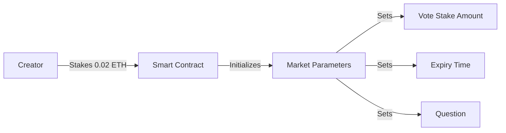
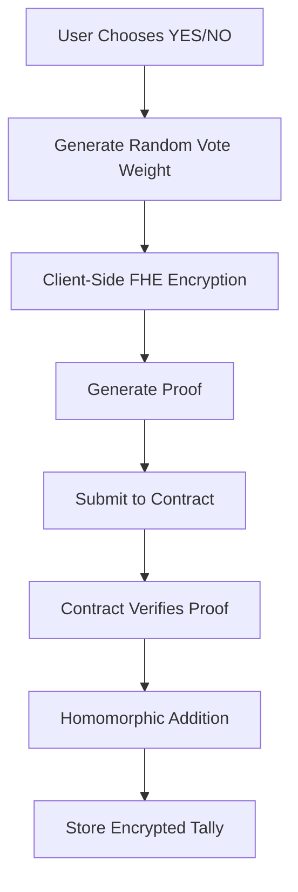
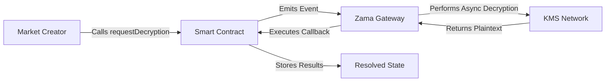

# 🔐 BeliefMarketFHE - Privacy-Preserving Prediction Markets

A decentralized prediction market platform built with Zama's Fully Homomorphic Encryption (FHE) technology, enabling completely private voting on blockchain.

[](LICENSE)
[](https://soliditylang.org/)
[](https://www.zama.ai/)
[](https://sepolia.etherscan.io/)
[](https://react.dev/)

🌐 **Live Demo**: [https://beliefmarket.vercel.app](https://beliefmarket.vercel.app)

---

## 📋 Table of Contents

- [Overview](#-overview)
- [Key Features](#-key-features)
- [How It Works](#-how-it-works)
- [Technology Stack](#-technology-stack)
- [Getting Started](#-getting-started)
- [Smart Contract Details](#-smart-contract-details)
- [Frontend Architecture](#-frontend-architecture)
- [User Guide](#-user-guide)
- [Development](#-development)
- [Testing](#-testing)
- [Deployment](#-deployment)
- [Security](#-security)
- [Contributing](#-contributing)
- [License](#-license)

---

## 🎯 Overview

BeliefMarketFHE is a next-generation prediction market platform that leverages **Fully Homomorphic Encryption (FHE)** to provide unprecedented privacy guarantees. Unlike traditional prediction markets where votes are publicly visible on-chain, BeliefMarketFHE ensures that:

- ✅ **Vote amounts remain encrypted** throughout the entire voting period
- ✅ **Voting patterns cannot be observed** by any participant or observer
- ✅ **Results are mathematically verifiable** through cryptographic proofs
- ✅ **Manipulation resistance** due to encrypted tallying

### What is Fully Homomorphic Encryption?

FHE allows computations to be performed directly on encrypted data without decrypting it first. In BeliefMarketFHE:

1. Users encrypt their votes locally before submission
2. Smart contracts perform addition operations on encrypted votes
3. Only after the voting period ends is the final tally decrypted
4. Individual votes remain private forever

---

## ✨ Key Features

### 🔐 Privacy-First Design

- **End-to-End Encryption**: Votes are encrypted on the client-side using Zama's FHE SDK
- **On-Chain Privacy**: Encrypted votes stored on blockchain remain unreadable
- **Homomorphic Operations**: Vote tallying happens on encrypted data using `FHE.add()`
- **Selective Decryption**: Only final results are decrypted via Zama Gateway

### 🏛️ Decentralized Governance

- **Permissionless Market Creation**: Anyone can create prediction markets
- **Binary YES/NO Markets**: Simple, clear outcome resolution
- **Staking Requirements**: Anti-spam mechanism through ETH staking
- **Automated Payouts**: Smart contract-based prize distribution

### ⚡ Modern Web3 Stack

- **React 18** with TypeScript for type-safe development
- **Vite** for lightning-fast hot module replacement
- **Wagmi v2 & Viem** for efficient Ethereum interactions
- **shadcn/ui** for beautiful, accessible components
- **RainbowKit** for seamless wallet connection

### 🎮 User Experience

- **Real-Time Transaction Feedback**: Live status updates with Etherscan links
- **Responsive Design**: Mobile-first approach with Tailwind CSS
- **Optimistic Updates**: Instant UI feedback with background verification
- **Error Recovery**: Comprehensive error handling and user guidance

---

## 🔄 How It Works

### Phase 1: Market Creation



**Details:**
- Market creators pay a platform stake fee (0.02 ETH)
- They define the question, resolution criteria, and voting parameters
- Markets are automatically added to the on-chain registry via `getAllBetIds()`

### Phase 2: Encrypted Voting



**Technical Flow:**

1. **Client-Side Encryption** (`src/lib/fhe.ts`):
   ```typescript
   const voteWeight = BigInt(1); // Fixed weight per vote
   const { handle, proof } = await encryptUint64(
     voteWeight,
     BELIEF_MARKET_ADDRESS,
     userAddress
   );
   ```

2. **Smart Contract Validation** (`contracts/LendingHub.sol`):
   ```solidity
   function vote(
       string memory betId,
       uint8 voteType,              // 0=No, 1=Yes
       externalEuint64 encryptedWeight,
       bytes calldata inputProof
   ) external payable {
       euint64 weight = FHE.fromExternal(encryptedWeight, inputProof);

       if (voteType == 1) {
           bet.yesVotes = FHE.add(bet.yesVotes, weight);
       } else {
           bet.noVotes = FHE.add(bet.noVotes, weight);
       }
   }
   ```

3. **Privacy Guarantee**: The contract only sees encrypted ciphertext (`euint64`), never plaintext values.

### Phase 3: Market Expiry & Counting

Once the voting deadline passes:
- Market enters "Counting" state
- No new votes accepted
- Encrypted tallies remain sealed
- Awaiting decryption request

### Phase 4: Decryption Request



**Decryption Process:**

1. Market creator calls `requestDecryption(betId)`
2. Contract emits `FHE.requestDecryption()` for both `yesVotes` and `noVotes`
3. Zama Gateway receives the request off-chain
4. Gateway performs decryption using the FHE key management system
5. Gateway calls back `resolveTallyCallback()` with plaintext results
6. Contract stores results and determines winner

**Callback Implementation:**
```solidity
function resolveTallyCallback(
    string memory betId,
    uint64 decryptedYesVotes,
    uint64 decryptedNoVotes
) public onlyGateway {
    bets[betId].yesVotesDecrypted = decryptedYesVotes;
    bets[betId].noVotesDecrypted = decryptedNoVotes;
    bets[betId].resolved = true;
}
```

### Phase 5: Prize Distribution

Winners can claim their proportional share:

```solidity
function claimPrize(string memory betId) external {
    uint256 userStake = userVoteStake[betId][msg.sender];
    uint256 totalWinnerStake = /* calculate total */;
    uint256 prizeAmount = (totalPrizePool * userStake) / totalWinnerStake;

    payable(msg.sender).transfer(prizeAmount);
}
```

**Payout Logic:**
- Prize pool = sum of all vote stakes
- Winner's share = (their stake / total winning stakes) × prize pool
- In case of tie: proportional refund to all participants

---

## 🏗️ Technology Stack

### Smart Contracts

| Component | Technology | Version |
|-----------|-----------|---------|
| **Language** | Solidity | 0.8.24 |
| **FHE Library** | @fhevm/solidity | 0.5.x |
| **Framework** | Hardhat | 2.26.3 |
| **Network** | Ethereum Sepolia | Chain ID 11155111 |
| **Encryption** | euint64 | 64-bit encrypted integers |

### Frontend Application

| Component | Technology | Version |
|-----------|-----------|---------|
| **Framework** | React | 18.3.1 |
| **Language** | TypeScript | 5.8.3 |
| **Build Tool** | Vite | 5.4.19 |
| **Styling** | Tailwind CSS | 3.4.17 |
| **UI Components** | shadcn/ui | Latest |
| **Web3 Hooks** | Wagmi | 2.19.1 |
| **Ethereum Client** | Viem | 2.38.5 |
| **Wallet Connection** | RainbowKit | 2.2.9 |
| **FHE SDK** | Zama Relayer SDK | 0.2.0 (CDN) |
| **State Management** | TanStack Query | 5.90.5 |

### Development Tools

- **ESLint** for code linting
- **TypeScript ESLint** for type checking
- **Hardhat Toolbox** for contract testing
- **Hardhat Ethers** for deployment scripts

---

## 🚀 Getting Started

### Prerequisites

Before you begin, ensure you have:

- **Node.js** >= 18.0.0 ([Download](https://nodejs.org/))
- **npm** or **yarn** package manager
- **Git** for version control
- **MetaMask** browser extension ([Install](https://metamask.io/))
- **Sepolia Testnet ETH** (~0.1 ETH for testing)

### Installation

1. **Clone the repository:**

   ```bash
   git clone https://github.com/yourusername/BeliefMarketFHE.git
   cd BeliefMarketFHE
   ```

2. **Install dependencies:**

   ```bash
   npm install
   ```

   This installs both frontend and Hardhat dependencies.

3. **Configure environment variables:**

   ```bash
   cp .env.example .env
   ```

   Edit `.env` and add your configuration:

   ```env
   # Required: Your Ethereum private key (for deployment only)
   PRIVATE_KEY=0x1234567890abcdef...

   # Required: Sepolia RPC endpoint
   SEPOLIA_RPC_URL=https://ethereum-sepolia-rpc.publicnode.com

   # Optional: Etherscan API key for contract verification
   ETHERSCAN_API_KEY=your_etherscan_api_key
   ```

   ⚠️ **Security Warning**: Never commit `.env` to version control!

### Configuration

The contract address and ABI are configured in `src/config/contracts.ts`:

```typescript
export const BELIEF_MARKET_ADDRESS = '0x35B1c3E1208Cf716d1d3558F30aE5de48f5fe3B4';
export const BELIEF_MARKET_ABI = [ /* ABI array */ ];
```

After deploying your own contract, update this file with your new address.

---

## 📦 Smart Contract Details

### Contract: BeliefMarketFHE

**Address (Sepolia)**: `0x35B1c3E1208Cf716d1d3558F30aE5de48f5fe3B4`

### Core Functions

#### `createBet()`

Creates a new prediction market.

```solidity
function createBet(
    string memory betId,
    uint256 voteStake,
    uint256 durationInSeconds
) external payable
```

**Parameters:**
- `betId`: Unique identifier (lowercase alphanumeric + hyphens)
- `voteStake`: Required stake per vote (minimum 0.005 ETH)
- `durationInSeconds`: Market duration (5 minutes to 30 days)

**Requirements:**
- `msg.value == platformStake` (0.02 ETH)
- `voteStake >= 0.005 ether`
- `5 minutes <= durationInSeconds <= 30 days`
- `betId` must not already exist

#### `vote()`

Submit an encrypted vote.

```solidity
function vote(
    string memory betId,
    uint8 voteType,
    externalEuint64 encryptedWeight,
    bytes calldata inputProof
) external payable
```

**Parameters:**
- `betId`: Market identifier
- `voteType`: 0 for NO, 1 for YES
- `encryptedWeight`: FHE-encrypted vote weight
- `inputProof`: Zero-knowledge proof of encryption

**Requirements:**
- `msg.value == voteStake` (market-specific)
- Market must not be expired
- User hasn't voted already

#### `requestDecryption()`

Initiates decryption of vote tallies (creator only).

```solidity
function requestDecryption(string memory betId) external
```

**Requirements:**
- Market must be expired
- Caller must be market creator
- Market not already resolved

#### `claimPrize()`

Allows winners to claim their rewards.

```solidity
function claimPrize(string memory betId) external
```

**Requirements:**
- Market must be resolved
- User must be a winner
- User hasn't claimed already

### Events

```solidity
event BetCreated(string indexed betId, address indexed creator, uint256 voteStake, uint256 expiryTime);
event VoteSubmitted(string indexed betId, address indexed voter, uint256 voteStake);
event DecryptionRequested(string indexed betId, uint256[] decryptionHandles);
event TallyResolved(string indexed betId, uint64 yesVotes, uint64 noVotes, bool yesWins);
event PrizeClaimed(string indexed betId, address indexed winner, uint256 amount);
```

### Storage Structure

```solidity
struct Bet {
    address creator;
    uint256 voteStake;
    uint256 expiryTime;
    uint256 totalStake;
    euint64 yesVotes;      // Encrypted YES vote count
    euint64 noVotes;       // Encrypted NO vote count
    uint64 yesVotesDecrypted;  // Decrypted YES votes
    uint64 noVotesDecrypted;   // Decrypted NO votes
    bool resolved;
    bool yesWins;
}

mapping(string => Bet) public bets;
mapping(string => mapping(address => bool)) public hasVoted;
mapping(string => mapping(address => uint256)) public userVoteStake;
mapping(string => mapping(address => uint8)) public userVoteType;
string[] private allBetIds;
```

---

## 🎨 Frontend Architecture

### Project Structure

```
src/
├── components/
│   ├── ui/                      # shadcn/ui components
│   │   ├── button.tsx
│   │   ├── card.tsx
│   │   ├── dialog.tsx
│   │   └── ...
│   ├── Header.tsx               # Navigation bar with wallet connection
│   ├── Footer.tsx               # Footer with links
│   ├── Hero.tsx                 # Landing page hero section
│   ├── HowItWorks.tsx          # How it works section with video
│   ├── Markets.tsx              # Market grid with filtering
│   ├── MarketCard.tsx           # Individual market card
│   ├── MarketDetailModal.tsx    # Detailed market view
│   ├── VoteModal.tsx            # Voting interface with FHE
│   └── CreateMarket.tsx         # Market creation form
├── hooks/
│   ├── useBeliefMarket.ts       # Contract interaction hooks
│   ├── useMarkets.ts            # Multi-market data fetching
│   ├── useMarketEvents.ts       # On-chain market discovery
│   └── use-toast.ts             # Toast notification hook
├── lib/
│   ├── fhe.ts                   # FHE encryption utilities
│   └── utils.ts                 # Helper functions
├── config/
│   ├── contracts.ts             # Contract address & ABI
│   ├── wagmi.ts                 # Wagmi configuration
│   └── markets.json             # Market metadata fallback
├── pages/
│   ├── Index.tsx                # Home page
│   └── NotFound.tsx             # 404 page
├── App.tsx                      # Root component with routing
└── main.tsx                     # Entry point
```

### Key Hooks

#### `useBeliefMarket()`

Custom hook for contract interactions:

```typescript
export function useBeliefMarket() {
  const { writeContract } = useWriteContract();
  const { address } = useAccount();

  const createBet = async (betId: string, voteStake: bigint, duration: bigint) => {
    writeContract({
      address: BELIEF_MARKET_ADDRESS,
      abi: BELIEF_MARKET_ABI,
      functionName: 'createBet',
      args: [betId, voteStake, duration],
      value: parseEther('0.02'),
    });
  };

  const vote = async (
    betId: string,
    voteType: 0 | 1,
    encryptedWeight: `0x${string}`,
    inputProof: `0x${string}`,
    voteStakeValue: bigint
  ) => {
    writeContract({
      address: BELIEF_MARKET_ADDRESS,
      abi: BELIEF_MARKET_ABI,
      functionName: 'vote',
      args: [betId, voteType, encryptedWeight, inputProof],
      value: voteStakeValue,
    });
  };

  // ... more functions
}
```

#### `useMarkets()`

Fetches all markets from the chain:

```typescript
export function useMarkets() {
  const { markets: marketIds } = useMarketEvents();

  // Fixed number of hooks (React rules compliance)
  const market1 = useMarket(marketIds[0] || '');
  const market2 = useMarket(marketIds[1] || '');
  // ... up to market10

  const allMarkets = useMemo(() => {
    return [market1.market, market2.market, /* ... */]
      .filter((m): m is MarketData => m !== null);
  }, [market1.market, market2.market, /* ... */]);

  return {
    markets: allMarkets,
    activeMarkets: allMarkets.filter(m => m.status === 'active'),
    countingMarkets: allMarkets.filter(m => m.status === 'counting'),
    completedMarkets: allMarkets.filter(m => m.status === 'completed'),
  };
}
```

### FHE Encryption Flow

The `fhe.ts` library handles client-side encryption:

```typescript
export async function encryptUint64(
  value: bigint,
  contractAddress: `0x${string}`,
  userAddress: `0x${string}`
): Promise<{ handle: `0x${string}`; proof: `0x${string}` }> {
  // Dynamically load Zama SDK from CDN
  await initFhevm();

  const input = await createEncryptedInput(contractAddress, userAddress);
  input.add64(value);

  const { handles, inputProof } = await input.encrypt();

  return {
    handle: handles[0],
    proof: inputProof,
  };
}
```

---

## 📖 User Guide

### For Market Creators

#### Step 1: Connect Wallet

1. Click "Connect Wallet" in the header
2. Select MetaMask (or your preferred wallet)
3. Approve the connection
4. Ensure you're on Sepolia testnet

#### Step 2: Create a Market

1. Navigate to "Create Market" section
2. Fill in the form:
   - **Question**: Clear, binary question (e.g., "Will Bitcoin reach $100k in 2025?")
   - **Description**: Detailed context and resolution criteria
   - **Vote Stake**: Minimum ETH required per vote (≥0.005 ETH)
   - **Expiry Date**: Voting deadline (5 min - 30 days)
3. Review parameters
4. Click "Create Market"
5. Approve transaction in MetaMask (0.02 ETH platform fee)
6. Wait for confirmation (~15 seconds)

#### Step 3: Monitor Your Market

- Check vote counts (encrypted, you can't see values)
- Wait for expiry time
- Once expired, click "Request Decryption"
- Wait 2-5 minutes for Zama Gateway callback
- Results will appear automatically

### For Voters

#### Step 1: Browse Markets

1. Scroll to "Active Markets" section
2. Filter by status (Active / Counting / Completed)
3. Click on a market card to view details

#### Step 2: Cast Your Vote

1. In the market detail modal, click "Vote"
2. Select YES or NO
3. Review vote stake amount
4. Click "Submit Vote"
5. **Wait for FHE encryption** (~5-10 seconds)
   - Progress indicator shows "Encrypting vote..."
6. Approve transaction in MetaMask
7. Wait for confirmation
8. View transaction on Etherscan (click the link in toast)

#### Step 3: Claim Rewards

1. After market is resolved, check results
2. If you're a winner, "Claim Prize" button appears
3. Click "Claim Prize"
4. Approve transaction
5. ETH is sent to your wallet

---

## 🛠️ Development

### Available Scripts

| Command | Description |
|---------|-------------|
| `npm run dev` | Start Vite development server (port 5173) |
| `npm run build` | Build production bundle to `dist/` |
| `npm run preview` | Preview production build locally |
| `npm run lint` | Run ESLint for code quality |
| `npm run compile` | Compile smart contracts |
| `npm run test` | Run Hardhat tests |
| `npm run deploy` | Deploy contract to Sepolia |
| `npm run verify` | Verify deployment status |
| `npm run create-markets` | Create test markets on Sepolia |

### Local Development

1. **Start the development server:**

   ```bash
   npm run dev
   ```

   Opens at `http://localhost:5173`

2. **Enable hot reload:**

   Vite automatically reloads on file changes.

3. **View in browser:**

   Access the app and connect your MetaMask to Sepolia.

### Smart Contract Development

1. **Compile contracts:**

   ```bash
   npm run compile
   ```

   Generates artifacts in `artifacts/` and `cache/`.

2. **Deploy to Sepolia:**

   ```bash
   npm run deploy
   ```

   Outputs contract address to console and saves to `deployments/`.

3. **Update frontend config:**

   Copy the deployed address to `src/config/contracts.ts`.

### Testing

Run the test suite:

```bash
npm test
```

**Test Coverage:**

- ✅ 49 utility tests passing
- ⚠️ 13 FHE contract tests (require Zama fhEVM setup)

**Test Files:**

- `test/BeliefMarketFHE.test.cjs` - Contract unit tests
- `test/utils.test.cjs` - Utility function tests

---

## 🚢 Deployment

### Smart Contract Deployment

1. **Prepare environment:**

   Ensure `.env` is configured with `PRIVATE_KEY` and `SEPOLIA_RPC_URL`.

2. **Deploy contract:**

   ```bash
   SEPOLIA_RPC_URL="https://ethereum-sepolia-rpc.publicnode.com" npm run deploy
   ```

3. **Save deployment info:**

   Note the contract address from console output.

4. **Update configuration:**

   Edit `src/config/contracts.ts`:
   ```typescript
   export const BELIEF_MARKET_ADDRESS = '0xYourNewAddress';
   ```

5. **(Optional) Create initial markets:**

   ```bash
   npm run create-markets
   ```

### Frontend Deployment (Vercel)

1. **Build the application:**

   ```bash
   npm run build
   ```

   Generates optimized bundle in `dist/`.

2. **Deploy to Vercel:**

   Using Vercel CLI:

   ```bash
   npm install -g vercel
   vercel login
   vercel --prod
   ```

   Or connect your GitHub repo to Vercel dashboard.

3. **Configure Vercel:**

   Add `vercel.json` (already included):

   ```json
   {
     "rewrites": [
       {
         "source": "/(.*)",
         "destination": "/index.html"
       }
     ]
   }
   ```

   This enables SPA routing (prevents 404 on refresh).

4. **Set environment variables:**

   In Vercel dashboard, add any required environment variables.

5. **Deploy:**

   Push to main branch or run `vercel --prod`.

---

## 🔒 Security

### Smart Contract Security

#### Implemented Protections

✅ **Reentrancy Guard**: Using OpenZeppelin's `ReentrancyGuard`

```solidity
function claimPrize(string memory betId) external nonReentrant {
    // Safe withdrawal pattern
}
```

✅ **Access Control**: Owner-only functions for platform management

```solidity
modifier onlyOwner() {
    require(msg.sender == owner, "Not owner");
    _;
}
```

✅ **FHE Constraints**: Validation of encrypted inputs

```solidity
require(FHE.isEncrypted(weight), "Invalid ciphertext");
```

✅ **State Checks**: Prevention of double-voting and double-claiming

```solidity
require(!hasVoted[betId][msg.sender], "Already voted");
require(!hasClaimed[betId][msg.sender], "Already claimed");
```

✅ **Input Validation**: Parameter bounds checking

```solidity
require(voteStake >= 0.005 ether, "Vote stake too low");
require(durationInSeconds >= 5 minutes, "Duration too short");
require(durationInSeconds <= 30 days, "Duration too long");
```

#### Potential Risks

⚠️ **Gateway Dependency**: Decryption relies on Zama Gateway availability

- **Mitigation**: Implement timeout fallback for refunds

⚠️ **Front-Running**: Market resolution timing can be observed

- **Mitigation**: Use VRF for unpredictable resolution triggers

⚠️ **Oracle Problem**: Result verification depends on creator honesty

- **Mitigation**: Implement dispute mechanism or integrate Chainlink oracles

### Frontend Security

✅ **Private Key Protection**: Never expose private keys in frontend code

✅ **Input Sanitization**: Validation of all user inputs

✅ **HTTPS Only**: Enforce secure connections

✅ **Wallet Signature Verification**: Verify transaction signatures

### Operational Security

- 🔐 Store private keys in secure vaults (not in `.env` on production servers)
- 🔍 Use hardware wallets for deployment accounts
- 📝 Conduct regular audits of smart contracts
- 🚨 Implement monitoring for unusual activity

---

## 🤝 Contributing

We welcome contributions from the community!

### How to Contribute

1. **Fork the repository**

2. **Create a feature branch:**

   ```bash
   git checkout -b feature/AmazingFeature
   ```

3. **Make your changes:**

   - Follow existing code style
   - Add tests for new functionality
   - Update documentation as needed

4. **Commit your changes:**

   ```bash
   git commit -m 'Add some AmazingFeature'
   ```

5. **Push to the branch:**

   ```bash
   git push origin feature/AmazingFeature
   ```

6. **Open a Pull Request**

### Coding Standards

- **TypeScript**: Use strict mode, avoid `any` types
- **React**: Follow hooks best practices
- **Solidity**: Follow Solidity style guide
- **Comments**: Document complex logic
- **Testing**: Maintain >80% coverage

### Areas for Contribution

- 🐛 Bug fixes
- ✨ New features (e.g., multi-outcome markets)
- 📚 Documentation improvements
- 🎨 UI/UX enhancements
- 🔐 Security audits
- 🌐 Internationalization

---

## 📄 License

This project is licensed under the **MIT License**.

```
MIT License

Copyright (c) 2025 BeliefMarketFHE

Permission is hereby granted, free of charge, to any person obtaining a copy
of this software and associated documentation files (the "Software"), to deal
in the Software without restriction, including without limitation the rights
to use, copy, modify, merge, publish, distribute, sublicense, and/or sell
copies of the Software, and to permit persons to whom the Software is
furnished to do so, subject to the following conditions:

The above copyright notice and this permission notice shall be included in all
copies or substantial portions of the Software.

THE SOFTWARE IS PROVIDED "AS IS", WITHOUT WARRANTY OF ANY KIND, EXPRESS OR
IMPLIED, INCLUDING BUT NOT LIMITED TO THE WARRANTIES OF MERCHANTABILITY,
FITNESS FOR A PARTICULAR PURPOSE AND NONINFRINGEMENT. IN NO EVENT SHALL THE
AUTHORS OR COPYRIGHT HOLDERS BE LIABLE FOR ANY CLAIM, DAMAGES OR OTHER
LIABILITY, WHETHER IN AN ACTION OF CONTRACT, TORT OR OTHERWISE, ARISING FROM,
OUT OF OR IN CONNECTION WITH THE SOFTWARE OR THE USE OR OTHER DEALINGS IN THE
SOFTWARE.
```

---

## 🔗 Resources

### Official Documentation

- **Zama Website**: [https://www.zama.ai/](https://www.zama.ai/)
- **fhEVM Documentation**: [https://docs.zama.ai/fhevm](https://docs.zama.ai/fhevm)
- **Zama GitHub**: [https://github.com/zama-ai/fhevm](https://github.com/zama-ai/fhevm)
- **Relayer SDK**: [https://github.com/zama-ai/fhevm-relayer-sdk](https://github.com/zama-ai/fhevm-relayer-sdk)

### Learning Resources

- **FHE Basics**: [https://www.zama.ai/introduction-to-fhe](https://www.zama.ai/introduction-to-fhe)
- **Solidity Docs**: [https://docs.soliditylang.org/](https://docs.soliditylang.org/)
- **React Documentation**: [https://react.dev/](https://react.dev/)
- **Wagmi Documentation**: [https://wagmi.sh/](https://wagmi.sh/)
- **Viem Documentation**: [https://viem.sh/](https://viem.sh/)

### Community

- **Discord**: [Zama Community Discord](https://discord.gg/zama)
- **Twitter**: [@zama_fhe](https://twitter.com/zama_fhe)
- **GitHub Issues**: [Report bugs here](https://github.com/yourusername/BeliefMarketFHE/issues)

---

## 📞 Support

### Getting Help

1. **Documentation**: Check this README and linked docs
2. **FAQs**: See [FAQ.md](./FAQ.md) for common questions
3. **GitHub Issues**: [Open an issue](https://github.com/yourusername/BeliefMarketFHE/issues/new)
4. **Zama Discord**: Ask the community

### Common Issues

#### "Transaction Reverted"

- Ensure you have sufficient Sepolia ETH
- Check that the market hasn't expired
- Verify you haven't already voted

#### "Encryption Failed"

- Check your internet connection (CDN load required)
- Ensure MetaMask is connected
- Try refreshing the page

#### "Gateway Callback Timeout"

- Zama Gateway may be experiencing delays
- Wait up to 10 minutes
- Check Sepolia network status

---

## 🙏 Acknowledgments

- **Zama** for pioneering FHE technology
- **OpenZeppelin** for secure contract libraries
- **Vite team** for blazing-fast build tools
- **shadcn** for beautiful UI components
- **Ethereum Foundation** for Sepolia testnet

---

## 📊 Project Stats

- **Contract Address**: `0x35B1c3E1208Cf716d1d3558F30aE5de48f5fe3B4`
- **Network**: Ethereum Sepolia Testnet
- **Lines of Code**: ~5,000+
- **Test Coverage**: 49 passing tests
- **Version**: 1.0.0
- **Last Updated**: October 31, 2025

---

## 🗺️ Roadmap

### Version 1.1 (Q4 2025)

- [ ] Multi-outcome markets (not just YES/NO)
- [ ] Market categories and tagging
- [ ] Advanced filtering and search
- [ ] User reputation system

### Version 1.2 (Q1 2026)

- [ ] Mobile app (React Native)
- [ ] Mainnet deployment
- [ ] Governance token integration
- [ ] Liquidity pools for markets

### Version 2.0 (Q2 2026)

- [ ] Cross-chain support
- [ ] Oracle integration (Chainlink)
- [ ] Dispute resolution mechanism
- [ ] NFT-based market shares

---

**Built with ❤️ using Zama FHE Technology**

⭐ **Star this repo** if you find it useful!

🐛 **Found a bug?** [Open an issue](https://github.com/yourusername/BeliefMarketFHE/issues)

💡 **Have an idea?** [Start a discussion](https://github.com/yourusername/BeliefMarketFHE/discussions)
